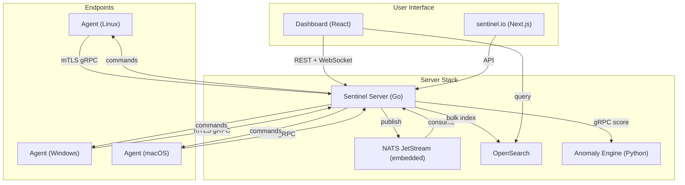
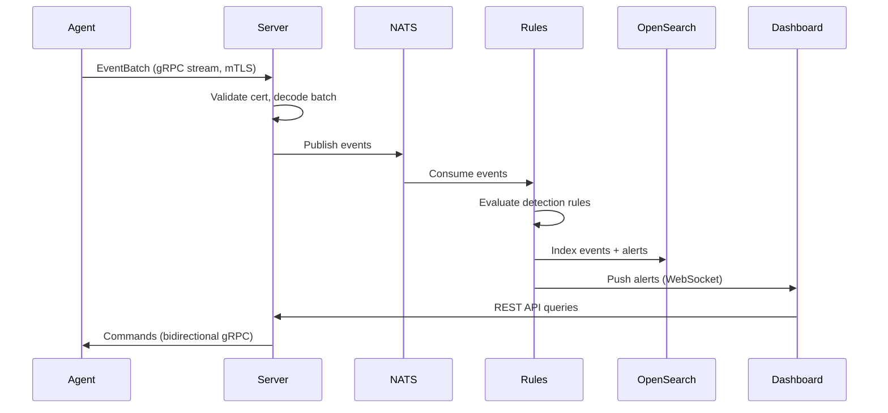

# Architecture Overview

## System Architecture

## Data Flow

## Network Topology

| Connection | Protocol | Encryption | Port |
|---|---|---|---|
| Agent → Server (telemetry) | gRPC (HTTP/2) | mTLS 1.3 | 4222 |
| Server → Agent (commands) | gRPC bidirectional | mTLS 1.3 | Same |
| Dashboard → Server (API) | REST + WebSocket | TLS 1.3 | 8443 |
| Server → OpenSearch | HTTPS REST | TLS 1.3 | 9200 |
| Server → Anomaly Engine | gRPC | TLS | 50051 |
| Browser → Dashboard | HTTPS | TLS 1.3 | 443 |

## Component Details

### Sentinel Server (Go)
- Event ingestion via gRPC
- Detection rules engine (YAML-based, Sigma-compatible)
- Embedded Certificate Authority (ECDSA P-256)
- REST + WebSocket API for dashboard
- Embedded NATS JetStream for message queuing

### Sentinel Agent (Go)
- Single static binary, CGO_ENABLED=0
- Target: <30MB RAM, <2% CPU idle
- Modules: process events, FIM, network flows, logs, metrics
- Local event buffering (WAL-style, 500MB default)
- Auto-enrollment with zero manual configuration

### Dashboard (React + TypeScript)
- Vite-based React 18 application
- Drag-and-drop widget builder (react-grid-layout)
- Real-time updates via WebSocket
- Dark theme by default

### Anomaly Engine (Python + FastAPI)
- Isolation Forest model for behavioral anomaly detection
- 7-day baseline learning period
- Anomaly score 0.0 - 1.0 (alert at >= 0.85)
- Weekly model retraining on 30-day rolling window

### OpenSearch
- Primary data store for events, alerts, agent metadata
- Pre-configured index templates and ISM policies
- 90-day event retention, 365-day alert retention
